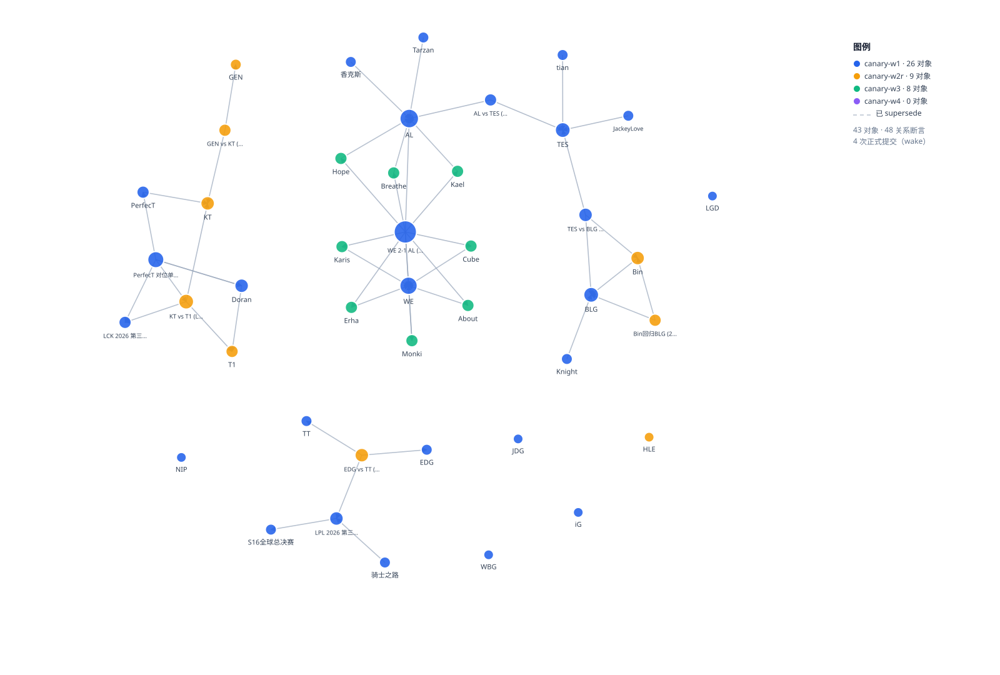
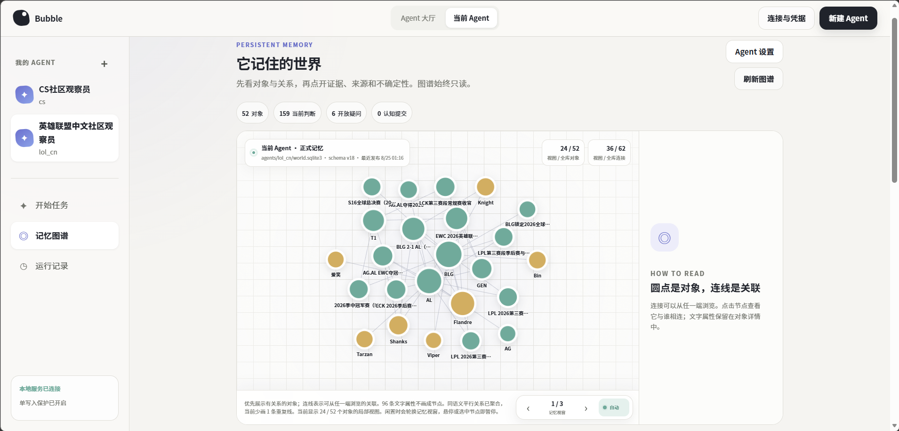

<h1 align="center">Bubble</h1>

<h3 align="center">让 Agent 替你持续认识一个世界。</h3>

<p align="center">
  一个会刷视频、逛论坛、阅读网页，并在多次运行之间积累和修正长期记忆的领域观察 Agent。
</p>

<p align="center">
  <a href="#快速开始">快速开始</a> ·
  <a href="#graph-shell">Graph Shell</a> ·
  <a href="#它现在能做什么">当前能力</a> ·
  <a href="docs/getting-started.md">上手指南</a>
</p>

<p align="center">
  <a href="https://www.python.org/downloads/">
    
  </a>
  <a href="./LICENSE">
    
  </a>
</p>

## 让 Agent 在一个领域里待下来

网页 AI 已经很会搜索，也很会完成任务。但它通常仍然需要你先知道发生了什么、
什么值得关注，以及应该怎么问。

如果只说一句“最近有什么热点”，得到的往往是一次新的搜索和摘要。下一次运行，
它不会自然记得上次认识了谁、哪个说法发生了变化、哪些问题仍然没有答案。
无论来过多少次，它都像第一次到访。

Bubble 想试试另一种方式：让 Agent 持续观察一个领域，自己去看
视频、论坛和网页，把值得留下的痕迹整理成一份长期世界记忆；以后遇到新材料时，
它可以沿着过去的认识继续探索，也可以回来修正自己。

**如果每次醒来都会失忆，Agent 永远只是游客。持久记忆让它有机会慢慢成为居民。**

当前版本选择中文英雄联盟社区作为实验场景。这里有比赛、选手、转会、社区讨论、
视频内容和大量需要上下文才能看懂的梗——很适合观察一个 Agent 能否在多次运行中
逐渐认识同一个世界。

## Graph Shell

让 Agent 长期记忆，并不等于让模型一次性吐出一大段 JSON，再把它塞进数据库。

早期实验里，这种方式很容易失控：同一个人被创建两次、新断言引用了不存在的对象、
十条修改中有一条坏掉却让整批结果无法安全落库。更关键的是，模型看不到自己刚刚
改了什么，也就很难检查和修正。

Coding Agent 提供了一个更有用的类比。它不会一次性生成整个项目，而是不断地
搜索、读取、编辑、查看 diff、运行测试，最后提交。于是我把数据库也变成了 Agent
可以观察和操作的环境：

```text
search → read → compare → patch → inspect → finalize
```

这套交互方式叫作 **Graph Shell**。

```text
外部素材 ──► Agent ──► 工作图 ──► 检查 / 调整 ──► 原子发布
                ▲                                  │
                └──────── 正式世界记忆 ◄───────────┘
```

- **工作图**是一次运行的编辑区。修改可以逐步进行，也可以在中断后恢复；
- **正式图**只接收 Agent 主动确认发布的内容，宿主不会替它悄悄提交；
- 同一个对象是否应该复用、哪条判断应该被修正，由 Agent 明确表达；
- 旧判断不会消失，新的断言通过 `supersede` 链保留修订历史；
- 每次补丁都有幂等标识，一次运行至多产生一次原子认知提交。

Graph Shell 不是另一种知识图谱格式。它更像是给 Agent 准备的一间工作室：
数据库负责保存状态和守住边界，模型负责观察、判断和修改。

## 一个世界是怎样长出来的

<p align="center">
  
</p>

上图来自同一个世界库的四次连续运行。不同颜色表示对象第一次被哪次运行写入；
虚线表示后来被新判断替换的旧断言。

它没有在第一次运行时“一次性建完知识图谱”：Agent 看到了什么，就先留下什么；
后来遇到更多材料，再补充人物和事件；有时没有新增对象，只是改变了对旧信息的判断。
世界记忆是在一次次 wake 中长出来的，而不是在一段超长提示词里生成的。

这里的 `wake` 指 Agent 的一次独立运行。每次 wake 都从新的对话上下文开始，
但会先读取已经发布的世界记忆。

## 它现在能做什么

一次真实 wake 大致会经历这些事情：

```text
醒来 → 回忆已有认知 → 选择探索方向 → 搜索 / 阅读外部内容
    → 创建或修正记忆 → 检查工作图 → 发布，或暂存等待恢复
```

当前公开实现包括：

- 浏览 B站、NGA、虎扑和公开网页等来源；
- 保存人物、事件、概念、关系、断言、开放问题和来源材料；
- 区分事实、社区观点和推测等不同认知角色，并记录置信度与证据；
- 在后续 wake 中搜索、展开、比较和追溯已有记忆；
- 发现旧判断需要更新时建立修订链，而不是覆盖历史；
- 在预算、超时、断网或模型没有完成发布时保留工作图，之后继续；
- 将正式世界图渲染为 SVG，或导出为供其他界面读取的 JSON。

公开版本包含同一套单 Agent 内核的两个界面：

- **Console UI**（本地管理控制台）：`bubble-console`，仅在 `127.0.0.1` 上运行，用于查看世界记忆、
  启动运行和管理 Agent 配置；
- **新闻 Web**（内容展示页）：`web/`，只读展示每期内容产出（Edition）；计划作为独立 GitHub
  项目仓库发布，并从该仓库启用 GitHub Pages 项目站点，而不是挂载到个人主页仓库。

两者职责不同：Console 是个人观测工具，新闻 Web 是公开内容展示。公开库只附带
`lol_cn` Agent 配置和 Web 已发布 JSON；不附带任何 world/runtime SQLite 数据库、
个人凭据、Cookie 或其他本地 Agent 配置。

<p align="center">
  
</p>

<p align="center">
  <sub>开发环境中大约 10 次真实 wake 后的截图。公开仓库仅内置 LOL Agent；截图中的其他私人 Agent 配置与数据库不在仓库内。</sub>
</p>

## 快速开始

需要 Python 3.11 或更高版本。离线 demo 不需要 API key，不访问网络，也不会调用模型。

```bash
git clone https://github.com/Bubble-Observer/bubble.git
cd bubble
python -m venv .venv
```

激活虚拟环境：

```powershell
# Windows PowerShell
.\.venv\Scripts\Activate.ps1
```

```bash
# macOS / Linux
source .venv/bin/activate
```

安装并运行（核心依赖自动安装，控制台 `bubble-console` 所需
的 starlette/uvicorn/aiosqlite 已包含在内）：

```bash
python -m pip install -e .
python examples/offline_demo.py
```

需要 B站字幕转录（ASR）时额外安装 `media` 可选依赖：

```bash
python -m pip install -e ".[media]"   # faster-whisper，支持 CUDA 与 CPU
```

你会看到四次连续 wake：第一次建立认知，第二次复用同一个事件并修正比分，第三次
在发布前停止，第四次从检查点恢复并完成发布。

```text
wake 1: published
wake 2: published
wake 3: staged_unpublished
wake 4: published
formal graph: 4 objects, 5 assertions, 3 commits

DEMO PASSED: four wakes ...
```

这个 demo 使用脚本化模型演练 Graph Shell 的完整状态变化。它的目的不是模拟一个
聪明的真实 Agent，而是让你用几条命令看到：记忆可以跨运行复用、修正、中断和恢复。

### 启动本地控制台（Console UI）

```bash
bubble-console
```

然后浏览器打开 http://127.0.0.1:8765 控制台是本地管理界面：查看世界记忆、
启动/恢复运行、管理 Agent 配置、手动收尾滞留的未发布工作图。它只监听回环地址
（非 loopback host 会被拒绝），不会对外提供服务。

仓库自带 `data/run-configs/agents/lol_cn.json`，因此首次启动就能看到 LOL Agent；
它只包含领域与运行默认值。第一次真实 wake 才会在 gitignored 的
`data/agents/lol_cn/` 下创建本地 world/runtime 数据库。

首次使用真实模型时，在页面右上角打开“连接与凭据”填入自己的 DeepSeek API key；
这些值只保存在本地 `.env`，不会进入 Agent 配置或公开数据。

### 把 demo 世界画出来

```bash
python examples/offline_demo.py --keep-world data/demo-world.sqlite3
python scripts/render_world_graph.py data/demo-world.sqlite3 --color-by-wake --out my-world.svg
```

导出给其他界面使用的 JSON：

```bash
python scripts/render_world_graph.py data/demo-world.sqlite3 --json my-world.json
```

### 运行一个真实 wake

真实运行目前使用 DeepSeek，需要付费 API key。先复制环境配置并填写
`DEEPSEEK_API_KEY`：

```bash
cp .env.example .env
# Windows PowerShell: Copy-Item .env.example .env
```

然后运行：

```bash
bubble-world --thread-id my-first \
  --world-db data/agents/lol_cn/world.sqlite3 \
  --runtime-db data/agents/lol_cn/runtime.sqlite3 \
  --domain lol_cn --max-cost-usd 0.5
```

默认会使用 B站、NGA、虎扑和公开网页适配器。Cookie 不是离线 demo 的要求；
真实来源的账号准备、成本边界、常用参数和恢复方式请看
[上手指南](docs/getting-started.md)。

> 真实 wake 会访问第三方网站并产生模型费用。建议先使用隔离数据库、专用站点账号和较小预算熟悉流程。

## 如果一次运行没有发布

这并不一定表示数据丢了。Graph Shell 会把尚未发布的工作留在工作图中，并保留
写者租约，避免另一个 wake 同时修改同一个世界。

先查看状态：

```bash
bubble-world --thread-id my-first --world-db data/world.sqlite3 --runtime-db data/runtime.sqlite3 --graph-shell-status
```

然后使用状态中显示的原 `thread-id` 和 `wake-id` 恢复：

```bash
bubble-world --thread-id my-first --world-db data/world.sqlite3 --runtime-db data/runtime.sqlite3 --resume --wake-id <wake-id>
```

宿主不会因为预算耗尽或进程结束就自动发布 Agent 尚未确认的认知。

## 从记忆出发，而不只是从搜索框出发

世界记忆本身不是最终内容。目前我也在尝试让另一个更强的 Agent 读取长期世界库，
再根据最近发生的变化生成新闻和分析。

理想中的产出不只是总结当天搜到的几条链接，而是能够利用过去积累的人物关系、
历史事件、社区观点和开放问题，解释“这次究竟改变了什么”。这仍然需要来源检查和
人工判断，但它展示了另一种可能：内容生成可以从一份已经生活了一段时间的记忆
出发，而不是每次都从空白搜索框开始。

不过，调用一个外部强 Agent 来完成最后一步还不是完整闭环。后续会把发现热点、
形成选题、读取相关记忆、写作、来源检查和发布逐步放回系统本身，让它不依赖另一个
更强的 Agent 才能把自己认识到的世界讲出来。

公开仓库在这一层只保留 `web/` 展示代码和可直接加载的已发布 JSON，方便挂载
到独立项目仓库自己的 GitHub Pages 项目站点；它不依赖个人主页仓库。内部产出
Prompt、产出后端和用于生成内容的本地数据库不属于开源范围。

<!--
内容展示位：建议放一篇代表性新闻或分析的截图，并在旁边列出它实际调用的 3～5 条
历史记忆。避免只展示成品；“新素材 + 旧记忆 = 新理解”才是这一节的重点。

<p align="center">
  
</p>
-->

## 它记住的是认知，不是真理

数据库保存的是 Agent 在特定材料和上下文下形成的认知，不是一份自动获得权威的
“真相库”。模型可能误解材料，来源也可能互相冲突。

因此，这个项目更关心的是：一条判断来自哪里、它属于事实还是观点、Agent 当时有
多大把握，以及它后来为什么被修正。过滤无法消失，但过滤过程至少可以被看见、
追溯和继续讨论。

## 它真的能跳出信息茧房吗？

现在还不能保证。

推荐算法会固化人的兴趣，模型也可能固化自己的搜索方向：重复相似的关键词，偏爱
熟悉的来源，或者在已经知道的内容附近打转。长期记忆解决了“每次醒来都失忆”，
但不会自动解决“总是在看同一种东西”。

这也是项目接下来最有意思的部分：让 Agent 不只会调用工具，还能从长期探索结果中
学习怎样更有效地使用工具——发现认知空白、改变搜索方式、寻找不同社区的观点，
并区分“内容很多”和“真的认识了新东西”。

## 技术地图

```text
src/leave_information_bubble/
  world_agent/   CLI、LangGraph 运行循环、模型调用与成本边界
  world/         SQLite 世界记忆、召回、工作图、检查与发布
  channels/      B站 / NGA / 虎扑 / 公开网页来源适配器
  tools/         搜索、字幕、转写等外部工具
  gateway/       模型客户端（当前为 DeepSeek）
  security/      外部内容边界与 URL 策略
  console/       本地 Agent 管理、运行观测与只读记忆图

examples/        可直接运行的离线 demo
scripts/         世界图渲染与协议场景脚本
docs/            设计、架构、上手指南和当前限制
web/             可独立挂载的只读内容页与已发布 JSON
data/run-configs/agents/lol_cn.json  内置 LOL Agent（不含数据库或凭据）
```

几个重要的设计取舍：

- 世界记忆和运行检查点使用不同的 SQLite 数据库；
- 模型负责需要判断的事情，宿主只执行确定性的校验、隔离和发布；
- 外部网页只被当作材料，不会成为 Agent 的系统指令；
- 当前采用单世界、单写者模型，优先把恢复和历史审计做清楚。

深入阅读：

- [Graph Shell：工作图如何编辑、检查和发布](docs/graph-shell.md)
- [Architecture：当前代码结构与运行流程](docs/architecture.md)
- [Getting Started：真实来源、Cookie、参数和故障恢复](docs/getting-started.md)
- [Limitations：目前明确没有做到什么](docs/limitations.md)
- [Evaluation：离线场景与真实 wake 记录](docs/evaluation.md)

## 当前阶段

这是一个仍在生长的个人实验，不是生产级 Agent 平台，也不是已经泛化到所有领域的
长期记忆框架。当前公开版本聚焦于一个 Agent、一个中文英雄联盟领域世界、一个
SQLite 写者，以及一套已经能够完整运行的 Graph Shell CLI 与本地 Console。

它现在可以跨 wake 积累和修正认知，区分六类对象、显式记录事件时间，并对创建、
读取、扫描、关系拓扑和发布执行确定性契约。但它还不具备 wake 内的语义上下文压缩；
随着工具调用累积，完整工具结果与 schema 仍会持续占用上下文。外部来源仍是内置
适配器，模型网关虽然预留了抽象，目前真实运行主要接入 DeepSeek；记忆驱动的自主
内容发布也仍在整理。

## 接下来：看得更广，想得更久，自己完成表达

下一阶段并不是简单地继续堆功能，而是围绕同一件事补完整闭环：让 Agent 能够长期
生活在一个领域里，获得更丰富的感官，维持更长的思考，并把积累下来的认识转化成
真正有用的内容。

### Graph Shell：从“大而完整”走向渐进访问

Graph Shell 的下一轮重点不是增加更多数据库工具，而是让 Agent 用更低的上下文成本、
更明确的导航动作读取同一张图：

- **找**：让 `memory_search` 更像轻量 locator，只返回候选、命中片段和稳定 ID，
  不在 Agent 尚未选择对象时提前携带整套证据；
- **读**：为已选中的对象、判断或开放问题提供连贯的语义视图，同时保留必要的
  ID、状态、时间、截断和来源边界；
- **展开**：让 Agent 明确选择关系方向、类型、predicate、时间与状态，并为超级节点
  提供统一 cursor，而不是由固定上限和 ID 顺序替它决定下一批邻居；
- **降噪**：减少 19 个工具 schema 和重复结构在每轮请求中的稳定成本，并按需加载
  evidence、历史、working/formal 差异；
- **不打断现有运行**：新投影和新入口先以加性方式进入，经过离线对照与真实使用观察后，
  再决定旧入口是否逐步退役。

目标不是把图变成一份更大的摘要，而是给 Agent 一套接近
“定位 → 打开 → 沿关系继续 → 核验/追溯”的渐进访问路径。

### 更丰富、可插拔的“眼睛”

外部能力会逐步插件化。视频平台、论坛、搜索引擎、普通网页、字幕和转写不再只是
随项目一起实现的几组适配器，而是通过统一的插件接口接入。除了增加新平台，也会继续完善
B站、NGA、虎扑和公开网页的搜索、发现、翻页、正文获取与失败恢复能力。目标不是
做一个什么都抓的爬虫集合，而是让 Agent 清楚每种工具能看到什么、看不到什么，
并学会根据长期探索效果选择来源、改变关键词和寻找不同社区的视角。

### 可替换、也更耐久的“大脑”

模型层会从当前的 DeepSeek 实现继续扩展到更多模型 API 和兼容接口，让不同能力、
价格和上下文长度的模型可以承担观察、整理与写作等不同工作。

与此同时，需要解决长程工作本身的问题。目前还没有一套令人满意的运行上下文压缩方案，
也不能依赖模型把上百轮工具反馈一直完整放在上下文里。后续会探索如何把阶段性发现、
未完成工作和关键工具结果压缩成可恢复的工作状态，并继续调整提示词、停止条件和
探索节奏，让 Agent 不只是“能恢复”，而是真的能够把一项长期观察做下去。

### 从认识世界到讲述世界

内容生产会成为系统内部的正式环节：从世界记忆中发现变化和热点，结合历史关系与
开放问题形成选题，完成写作、来源检查和发布，并保留可选的人工审阅入口。目标是让
Agent 自己完成“观察 → 记忆 → 理解 → 表达”的循环，而不是必须把数据库交给另一个
更强的 Agent 才能得到一篇新闻。

### 继续打磨长期运行的底座

Graph Shell 和世界记忆本身也会持续优化，包括实体与别名判断、跨时间事件关系、
召回质量、数据库性能、成本与运行可观测性、安全边界、异常恢复、测试和文档。
在这些基础更稳定之后，再尝试更多领域，以及多个 Agent 用不同观察方式认识同一个
世界会发生什么。

如果你也对“让 Agent 在互联网的某个角落长期生活”感兴趣，欢迎阅读代码、运行
demo、提出问题，或者带它去认识另一个世界。贡献方式见
[CONTRIBUTING.md](CONTRIBUTING.md)。

## License

MIT，见 [LICENSE](LICENSE)。
